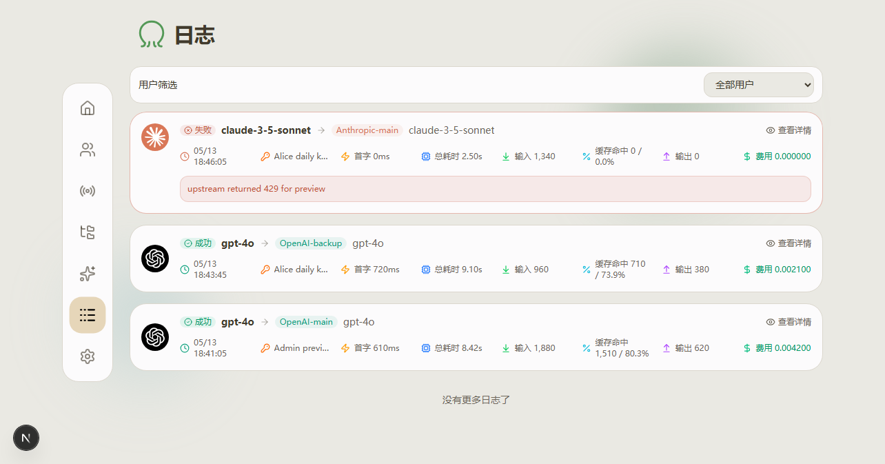
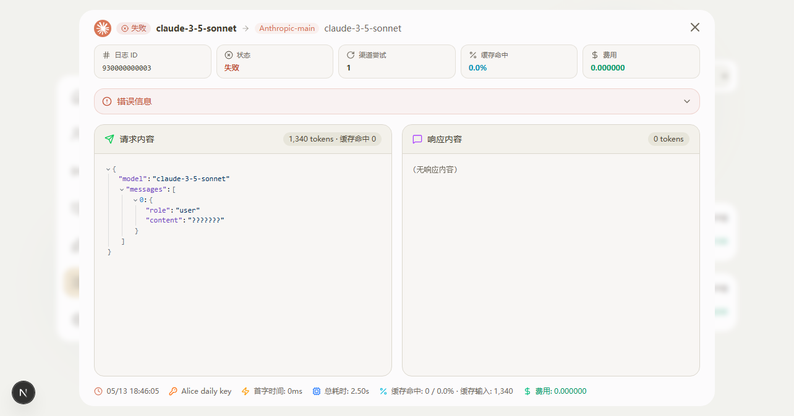
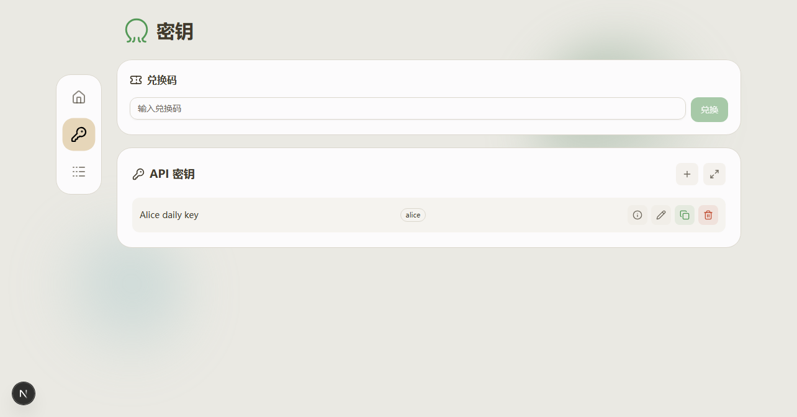
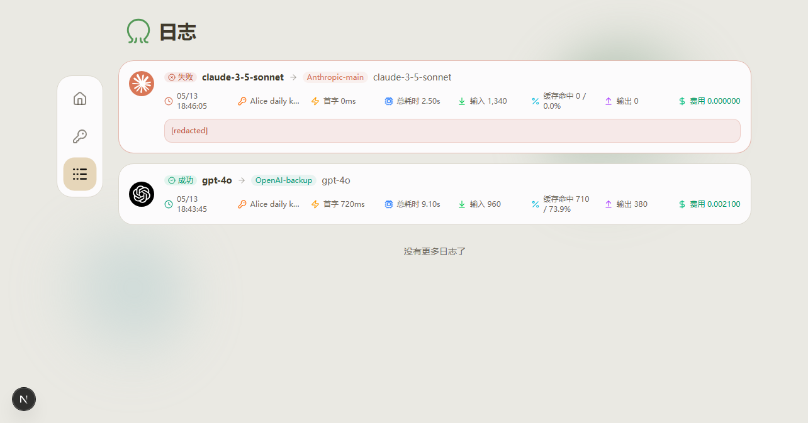

# Octopus

`zhizhishu/octopus` 是一个为个人打造的 LLM API 聚合与负载均衡服务，把缓存稳定性、多用户管理、日志审核、自动模型分组、模型测试、独立 API Key、提示词管理、协议互转、API Key 用法引导和 GHCR 镜像发布做成长期维护版本。

[](https://github.com/zhizhishu/octopus/actions/workflows/future-build.yml)

## CLIProxyAPI / Provider Base URL

OpenAI, Anthropic/Claude, and Gemini channels normalize Base URL by protocol. Admins can fill a root upstream address or a provider address such as `https://host`, `https://host/api/provider/openai`, `https://host/api/provider/anthropic`, or `https://host/api/provider/gemini`; Octopus appends the correct protocol endpoint.

If an old config already includes protocol suffixes such as `/v1`, `/v1/chat/completions`, `/v1/responses`, `/v1/messages`, `/v1/models`, `/v1beta`, `/v1beta/models`, or a concrete Gemini `:generateContent` / `:streamGenerateContent` path, Octopus strips that suffix before calling the real endpoint. Model tests and log attempts show `upstream_path`, so admins can verify the final path, for example `/api/provider/openai/v1/responses`, `/api/provider/anthropic/v1/messages`, or `/api/provider/gemini/v1beta/models/gemini-pro:generateContent`.

For Codex-style `/v1/responses` clients behind an OpenAI-compatible CPA/CLIProxyAPI upstream, Octopus keeps the inbound Responses contract for the client. If the upstream rejects `/v1/responses` with a compatibility status and the request is safe to express as Chat Completions, Octopus can retry the same channel/key through `/v1/chat/completions` and convert the successful Chat response back to Responses shape. Native Responses upstreams still use `/v1/responses` first.

For Claude/Anthropic clients behind CPA/CLIProxyAPI, Octopus keeps the client-facing `/v1/messages` streaming contract. CPA 1M aliases, for example `claude-opus-4-7[1m]`, are tried as real upstream streams first, because waiting for a slow non-stream response can hit common 60-second reverse-proxy idle limits and surface as `context canceled`. If an Anthropic upstream explicitly rejects stream with `502`, `503`, `504`, or `520`, Octopus can retry once as non-stream and re-emit the successful non-stream response as Anthropic SSE.

Cursor/agent clients sometimes send empty probe requests such as `messages: []`, `content: ""`, or whitespace-only text blocks. Future handles those locally before route selection, records an audit log marked `local_validation`, and does not forward them to CPA/CLIProxyAPI, so a bad probe cannot push the upstream into cooldown or pollute model ranking/cache-health stats. Normal empty probes return `client_empty_request`; Cursor/Cursor++-style Anthropic `/v1/messages` probes with `stream: true`, very large `max_tokens`, `reasoning_effort`, empty `tools`, and no effective input get a local Anthropic-shaped 200 stream marked `cursor_empty_probe` so Cursor health checks do not break the real model path. Real Anthropic tool-use, tool-result, image, file, audio, and reasoning messages are still treated as valid input.

Important route prerequisite: API Key permissions only decide which route/access plan a user may enter. A model call still needs either a same-name model group or an explicit route target for that request model. In the admin Route page, use "rebuild current route" after model sync, or click a model row's edit button in the mapping matrix to confirm channel, upstream model, billing model, and failure strategy.

Claude/Anthropic 渠道按协议自动处理 URL 后缀。渠道 Base URL 建议填写根地址或 provider 地址，例如 `https://host`、`https://host/api/provider/anthropic`；不要手动填写完整 `/v1/messages`。

如果旧配置里已经写了 `/v1`、`/messages`、`/v1/messages` 或 `/v1/models`，Octopus 会在 Anthropic 渠道里自动清理后再拼接正确端点：对话走 `/v1/messages`，模型同步走 `/v1/models`。模型测试和日志尝试记录会显示 `upstream_path`，方便确认最终打到了 `/v1/messages` 还是 `/api/provider/anthropic/v1/messages`。

## 最新发布重点（要点速览）

- **claude-code / Codex CLI 形态保真**：对接只认官方 CLI 形态的上游时，Octopus 把出站请求重建成与真实 claude-code / Codex CLI 一字不差的形态（User-Agent、`anthropic-beta` 规范顺序、billing/metadata、Codex instructions 与默认工具集），让这类上游把 Octopus 当作正规 CLI 客户端处理。全部是代码内置默认值，**部署即生效，无需任何配置**；渠道 `cloak.mode` 可关闭。
- **容量感知调度**：同优先级内按「健康分层 + 容量评分 + 轮转打底」分摊负载，配合三态熔断（指数退避 + 陈旧自愈）、选择期预留防并发踩踏、上游 429/5xx 分级冷却；打满并发也平稳，失败一律安全降级，绝不返回 0 可用渠道兜底。
- **全 provider 互转 + 国产模型**：OpenAI Chat / Responses、Anthropic Messages、Gemini、Volcengine（火山）、以及 DeepSeek、GLM（智谱）等 OpenAI 兼容上游统一互转，客户端拿回自己入口协议的响应。
- **多模态贯通**：图片（base64 / 远程 URL / file_id）、文档 / PDF、音频在 claude / OpenAI / Gemini 各路进出透传；Gemini 远程图自动转 `fileData` 并按后缀推断 mime；OpenAI `json_schema` 跨协议映射到 Anthropic `output_config.format`；图像生成（OpenAI / Imagen / Gemini / Grok）统一路由。
- **推理 / 思考透传**：claude 扩展思考（含 `max` 档 + 预算钳制到 `< max_tokens`）、Codex reasoning effort、Gemini `thinkingBudget` 回读、DeepSeek `reasoning_content`、GLM `thinking:{type}`（按 reasoning effort 自动映射）——各家推理控制与思维链输出在流式 / 非流式、跨协议下都接住，含思考块 signature 聚合。
- **IDE 工具兼容**：`POST /v1/messages/count_tokens`、Gemini `GET /v1beta/models` 列模型、Anthropic 内置工具（computer-use / bash / text_editor）透传、raw/SSE 长会话空闲闸 + keepalive —— Cursor / Cline / Continue / Claude Code 等 IDE 内编程工具开箱即用。
- **缓存稳定性修复**：缓存是本项目核心资产，ReplaceAll 快照替换、原子读改写、增量记账等改造保住命中率与一致性（详见下文第 1/2 节）。
- **运维与多用户**：控制台清晰（API Key / 价格独立成页）、四层提示词管理、友好错误码、模型单测 / 并发测试、每日签到、流式保活与静默超时可视化、New API 活跃用户迁移（离线命令 + 后台异步 Job 迁移页）。
- **个人部署友好**：镜像发布到 `ghcr.io/zhizhishu/octopus:future`（**公开，无需登录即可拉取**），推荐宿主机 `5050` 映射容器内 `8080`。

## 截图预览

<table>
  <tr>
    <td width="50%">
      
      <br>
      <sub>管理员用户管理：用户、角色、状态、余额、月卡、兑换码和用户排行集中管理。</sub>
    </td>
    <td width="50%">
      
      <br>
      <sub>管理员日志筛选：可查看全部用户，也可按指定用户筛选日志。</sub>
    </td>
  </tr>
  <tr>
    <td width="50%">
      
      <br>
      <sub>管理员日志详情：请求状态、错误信息、token、费用、延迟、缓存命中和渠道尝试可审计。</sub>
    </td>
    <td width="50%">
      
      <br>
      <sub>普通用户密钥页：只管理自己的 API Key，并通过兑换码获取额度或月卡。</sub>
    </td>
  </tr>
  <tr>
    <td width="50%">
      
      <br>
      <sub>普通用户日志：只能看自己的脱敏日志列表，不能点开输入/输出详情。</sub>
    </td>
    <td width="50%">
      <strong>权限边界</strong>
      <br>
      管理员负责用户、额度、兑换码、日志详情、提示词覆盖和全局配置；普通用户只保留首页、API Key、提示词说明、日志四个入口。这个边界适合个人或小范围服务分发，不引入复杂团队、支付或企业 RBAC。
    </td>
  </tr>
</table>

## 控制台入口速览

管理员入口：

- 首页：公开/管理统计、缓存率、模型健康和请求趋势。
- 用户：用户、角色、状态、余额、月卡、兑换码、邀请码、IP 审计。
- API Key：集中管理用户密钥、端点协议、可用方案组和限额。
- 渠道 / 方案组 / 分组 / 价格：管理上游、自动模型分组、方案组路由、倍率、本地模型价格和 `models.dev` 价格库更新。
- 模型测试：按系统默认或指定方案组，对单个模型或多模型并发做上游连通性检查。
- 提示词：管理全局、方案组、模型路由、渠道四层提示词覆盖。
- 日志：按用户筛选并查看完整请求/响应详情、缓存命中、错误和渠道尝试。
- 设置：只保留版本、外观、账号、系统、日志、渠道同步、熔断和备份等系统级配置。

普通用户入口：

- 首页：查看自己的余额、月卡、用量、缓存率和可见模型健康。
- API Key：创建和管理自己的密钥，查看可用端点家族和用法提示。
- 提示词说明：了解管理员提示词策略如何生效，但不展示实际策略内容。
- 日志：只查看自己的脱敏日志列表，不能打开输入/输出详情。

## 这个版本改了什么

### 1. 缓存稳定性修复

> 缓存是本项目的核心能力，不是可选优化。重构 relay、统计、日志、协议转换、API Key、渠道计费、模型分组时，都要做缓存回归测试，避免破坏命中率与一致性。

Future 分支吸收了 sub2api 的缓存思路，但没有照搬 Redis、支付、企业后台等重型体系，只保留适合 Octopus 单机部署的稳定改造：

- `ReplaceAll` 快照替换，避免刷新缓存时出现半旧半新的状态。
- `Update` 原子读改写，减少并发请求覆盖统计的问题。
- API Key 删除时同步失效反查缓存。
- 统计缓存按 shard 做增量更新，避免并发请求丢统计。
- 统计缓存刷新会回灌 `StatsModel`，避免重启后同一模型的新增统计覆盖历史模型统计。
- ChannelKey 使用记录改为增量记账，避免覆盖 `TotalCost`。
- delayed DB save 失败时恢复 dirty 标记，避免落库失败后静默丢数据。

缓存复查覆盖已保留能力、缓存率修复和缓存诊断接口。

### 2. Provider 原生缓存增强

- OpenAI 请求保留 `prompt_cache_key` / `prompt_cache_retention`。
- OpenAI Chat/Responses 可在客户端未传 `prompt_cache_key` 时自动生成不含明文的稳定 `octo_pc_*` 缓存 key；客户端显式值永远优先，管理员可在系统设置关闭。
- OpenAI 兼容缓存统计会额外识别 `usage.cached_tokens`、`usage.prompt_cache_hit_tokens`、`choices[].usage.cached_tokens` 和 `timings.cache_n`，避免上游实际命中缓存但 Octopus 日志/首页缓存率显示为 0。
- Anthropic 请求保留显式 `cache_control`。
- 开启自动缓存控制时，只做保守稳定的长前缀断点注入，不默认启用激进的多轮尾部改写。
- 管理员可通过 `/api/v1/stats/cache-diagnostics` 查看缓存诊断：按模型、用户、端点聚合，提示哪些 OpenAI Chat/Responses 请求缺 `prompt_cache_key`、哪些用户的稳定请求 key 不稳定、哪些 Claude/Anthropic 长前缀适合加 `cache_control`，并把尚未落库的近期日志也算进去。

### 3. 自动模型分组

渠道保存、手动刷新、定时同步模型后，会自动补齐缺失的同名模型分组，并挂载对应渠道模型。自动创建的空分组可随模型消失清理，但用户手动创建或编辑过的分组不会被覆盖。

### 4. 缓存观测与日志审核

- 首页显示缓存命中率。
- 模型健康区域按 OpenAI / Gemini / Anthropic 分组，并按 0-24 点显示每个模型的成功/失败请求热度。
- 每个模型展示首字延迟 P90、平均吞吐和缓存率。
- 模型排行榜按客户端请求模型统计，而不是按渠道、方案组或映射后的上游模型统计；`glm-5.1 -> claude-sonnet-4.5` 仍排在 `glm-5.1` 下。
- 日志详情可查看请求内容、响应内容、成功/失败状态、错误信息、渠道尝试、token、费用、延迟和缓存命中。
- 日志详情会标出入口端点/协议和原始请求路径，例如 `chat`、`responses`、`messages`，方便确认客户端到底走了哪个协议。
- 日志保留支持按 GB 设置容量上限，`0` 表示不按容量裁剪，只按保留天数处理。
- 固定缓存/协议回归样例放在 `internal/relay/protocol_compatibility_matrix_test.go`，以后融合 sub2api/new-api 时不靠感觉，直接跑矩阵看 OpenAI Chat、Responses、Claude Messages、Gemini、工具调用、空工具结果、流式保活和缓存字段有没有坏。

### 5. 真实多用户管理

- JWT 携带真实 `user_id`、用户名和角色。
- API Key 归属于真实用户，而不是把 Key 管理改名成用户管理。
- 管理员可管理用户、状态、角色、余额、月卡、兑换码和用户排行。
- 月卡按每日额度、今日已用/剩余、有效期和到期时间展示；底层 Unix 秒只应作为高级调试信息保留。
- 支持邀请码注册；邀请码复用兑换码额度/月卡规则，注册成功后自动发放对应权益。
- 管理员可在系统设置中允许新用户无邀请码直接注册；关闭时默认强制邀请码注册。
- 管理员可开启每日签到，按固定点数或随机区间发放余额奖励，普通用户在首页每天领取一次。
- 用户管理页记录注册 IP、最近一次 API 调用 IP 和最近调用时间，管理员日志详情保留请求 IP 审计。
- 普通用户只显示首页、API Key、提示词说明、日志四个入口；API Key 和提示词都是独立页面，不再混在系统设置里。
- 普通用户日志只看自己的脱敏列表，不能打开输入/输出详情。
- 管理员可查看全部日志，也可指定用户筛选，并保留详情审核能力。
- 额度和月卡都通过兑换码发放；管理员可完整查看和管理兑换码。
- 提供离线 `migrate-newapi` 工具，把 New API 中至少有一次模型消费记录的活跃用户迁移进 Octopus；只迁移用户、余额和用量摘要，不迁移旧 API Key 或详细历史日志，零用量注册机账号默认不导入。
- 管理员后台新增“迁移”页面：先创建 dry-run 后台 Job，页面轮询扫描用户、扫描日志、报告、导入、完成等阶段；正式导入必须引用同配置的成功 dry-run，并输入确认文本，避免长请求卡死或误写库。

### 6. 方案组路由与倍率计费

- 首次迁移会创建 `vip`、`svip`、`ssvip` 方案组，管理员可改名、启停并创建自定义方案。
- 管理员可继续扩展 `A/B/C/D` 等自定义方案组，用于不同用户或 API Key 的模型能力分层。
- 用户管理页可限制每个用户可使用的方案组；该用户创建或持有的 API Key 只能继承并切换这些被授权的方案组。
- 方案页面提供模型映射矩阵，按请求模型展示当前方案的渠道、上游模型、权重、fallback、计费模型来源和倍率；多方案存在时支持跨方案对比。
- 每个 API Key 可以绑定允许使用的方案组和默认方案，请求头 `X-Octopus-Plan` / `X-Octopus-Group` 只能在授权范围内切换。
- 每个 API Key 还可以限制协议端点家族：OpenAI-compatible、Anthropic/Claude、Gemini；不允许的协议会返回 `endpoint_not_allowed`。
- 每个方案组可配置请求模型到指定渠道/上游模型的定向路由；未配置时继续回落到原有同名模型分组。
- 计费支持方案默认倍率和单模型倍率，日志会记录当次方案组、路由、计费模型、基础价格、倍率和最终费用快照。
- 价格库默认来自 `models.dev`，本地手动价格覆盖优先；价格菜单应保留更新按钮、最后更新时间、差异预览和批量覆盖能力。

支持月卡、兑换码、方案组映射和价格入口。

### 7. 模型路由计费、错误策略和提示词覆盖

Future 分支继续保留“用户请求什么模型，默认就按什么模型计费”的口径。比如方案组把 `glm-5.1` 路由到 `claude-sonnet-4.5`，默认仍按 `glm-5.1` 扣费；只有管理员明确选择“按上游模型计费”或“按指定模型计费”时才改变。

管理端失败策略要说人话，不只显示 `fallback`：例如“失败后直接报错”“失败后尝试下一个路由目标”“失败后回到原模型分组”。错误处理需要保留管理员日志里的真实上游状态/错误码，同时支持给用户看的公开错误码、上游状态码透传开关、错误正文脱敏和管理员自定义用户提示。关闭状态码透传后，用户会看到统一网关错误和类似 `service_busy` 的公开错误码，而不是上游 429/430/530。

提示词覆盖按“全局 -> 方案组 -> 路由映射 -> 渠道”生效，默认追加 system/developer 提示，不强制覆盖客户端原始 system。管理端保留独立“提示词管理”页面，但设置页不再放快捷入口；普通用户只看到只读说明，避免泄露管理员策略。日志需要记录计费模型来源、失败策略、错误策略、提示词覆盖来源和模式，避免后续同步上游时丢失审计依据。

规则采用轻量错误提取、日志脱敏和模型映射表单整理；模型重定向默认按原请求模型计费；不引入 Redis、支付、企业后台、复杂熔断、队列或 SaaS 账单体系。

### 8. 管理员模型测试

模型测试页提供管理员运维用的轻量连通性测试：

- 单个模型测试和多模型并发测试共用 `/api/v1/model/test`。
- 可选择系统默认方案组或指定 `vip` / `svip` / `ssvip` / 自定义方案组，测试结果会显示是否走了方案路由。
- 路由模型仍显示客户端请求模型和实际上游模型，便于确认 `glm-5.1 -> claude-sonnet-4.5` 这类映射。
- 结果表显示成功/失败、HTTP 状态、耗时、渠道、上游模型、响应预览、错误码和渠道尝试。
- 测试不会写入普通用户扣费、余额或常规用量日志，避免把管理员检查混进真实用户统计。

### 9. 协议补全

Future 分支在保留原有 Chat / Responses / Anthropic / Embeddings 转换链路的基础上，补齐了更常见的 OpenAI 兼容端点：

- 协议互转：OpenAI Chat/Responses、Anthropic Messages、Gemini `generateContent` 都会先转成内部统一请求，再按方案路由到 OpenAI、Anthropic 或 Gemini 上游；客户端仍拿回自己入口协议的响应格式。
- OpenAI Responses 入站会把缺省顶层输入角色当成 `user`，并把 `developer` 归一为内部 `system`，避免路由到 Claude/Gemini 时开发者指令丢失。
- Claude/Anthropic 流式请求会保留上游 `ping`，并在长时间空闲时发送 SSE 保活，降低 MCP 工具调用、长思考和反代链路里的断流概率；同时会用上游静默超时防止 provider 卡死后请求无限挂起。管理员可在“设置 -> 系统”分别调整保活间隔和静默超时，`0` 表示关闭对应保护。
- Relay 默认过滤客户端传进来的 SDK/CLI 身份和超时提示头：`user-agent`、全部 `x-stainless-*`、`x-request-timeout`、`request-timeout`、`grpc-timeout`。这些头常见于 Claude CLI、Codex、Cursor 或 SDK，含义更像“下游客户端自己的运行环境和最多等多久”，如果原样透传到 CPA/cliproxy 或上游，可能覆盖 CPA 自己配置的设备伪装 Header，或让 Claude/MCP、OpenAI Responses、后台工具回合被上游提前断开。过滤只作用于“客户端 -> Octopus”的请求头，不会删除 Octopus 渠道里配置的自定义 Header，也不会影响 cliproxy 自己再给它的上游添加 Header。若某个 cliproxy 方案确实需要这些头，请在 Octopus 渠道“自定义 Header”里显式配置，显式配置会在过滤后写入上游请求。
- 缓存、协议、日志、权限、额度和安全相关改动都应配套回归检查，避免影响命中率与一致性。
- Gemini 原生：`/v1beta/models/:model:generateContent`、`/v1beta/models/:model:streamGenerateContent`。
- 生图：`/v1/images/generations`、`/v1/images/edits`、`/v1/images/variations`。
- Codex/TOML 兼容别名：`/responses`、`/responses/compact`、`/backend-api/codex/responses`、`/backend-api/codex/responses/compact`。普通 Responses 别名仍走 Octopus 协议转换，`compact` 别名走 OpenAI 原样转发；流已经开始后如上游失败，会补发 `response.failed`，避免 Codex 客户端遇到 silent EOF。
- 原样转发：`/v1/completions`、`/v1/edits`、`/v1/responses/compact`、`/responses/compact`、`/backend-api/codex/responses/compact`、`/v1/audio/speech`、`/v1/audio/transcriptions`、`/v1/audio/translations`、`/v1/moderations`、`/v1/rerank`。

这些端点仍然走 Octopus 的 API Key、方案组路由、模型映射、失败重试、错误策略、计费快照和日志审计。音频等二进制响应会转发给客户端，但不会把大文件写进日志；multipart 上传只记录摘要，避免把文件内容落库。


### 10. 用户引导与 API Key 用法提示

Future 分支会参考 sub2api 的实用引导方式，但不搬入它的支付、企业后台、Redis 或 Ent 体系。目标是让管理员和普通用户不读源码也能知道怎么用：

- 管理员首次配置应有短清单：修改默认密码、创建渠道、同步模型、检查自动分组、设置方案组、设置注册模式、设置日志保留和 GB 容量上限。
- API Key 创建或编辑时，会按该 key 的真实权限显示端点家族和用法示例，只展示已允许的端点家族。
- OpenAI 兼容示例使用 `Authorization: Bearer <Octopus Key>`，Anthropic 使用 `x-api-key: <Octopus Key>`，Gemini 使用 `x-goog-api-key` 或 `?key=`。
- 当 key 允许多个方案组时，引导里要提示 `X-Octopus-Plan` / `X-Octopus-Group`，且只能在授权范围内切换。
- 普通用户只需要首页、API Key、提示词说明、日志四个入口的使用说明；管理员才看到提示词管理、全局设置、全用户筛选和完整日志详情。
- 额度、月卡、兑换码、缓存率、首字延迟、吞吐和错误状态都要用人话解释，不把 Unix 秒、内部字段或上游密钥暴露给普通用户。


### 11. claude-code / Codex CLI 形态保真

部分上游（例如某些聚合站的风控）只把官方 claude-code / Codex CLI 的请求形态当作可信客户端，裸 curl / SDK 会被挡。Octopus 对接这类上游时，把出站请求重建成与真实 CLI 一字不差的形态，保证被正常处理：

- **claude-code**：User-Agent（`claude-cli/<版本> (external, sdk-cli)`）、`anthropic-beta` 按官方规范顺序重建（含 1M context、prompt-caching、interleaved-thinking、effort 等）、billing header、`metadata.user_id`（device_id + session_id，且头部与请求体使用同一 UUID）、agent-identity system 块。
- **Codex**：`codex_exec` User-Agent / originator、`x-codex-*` 头、Codex instructions 与默认工具集、`store=false`、reasoning `encrypted_content`、installation / turn metadata。
- 这些形态全部是代码内置默认值，**部署即生效、无需任何配置**；渠道 `cloak.mode` 设 `never` / `off` 可关闭注入。1M context 作为「能力」而非模型名后缀，出站发 clean 模型名 + `context-1m` beta。
- 会话标识按 `apiKeyID:model:clientSessionKey` 隔离，Responses 的 `previous_response_id` 只转发给确实持有它的同渠道/同 key，跨 channel/key 强制丢弃，避免串会话。

### 12. 容量感知调度

调度在保留优先级硬边界的前提下，吸收 axonhub / CLIProxyAPI 思路做了容量感知（UI 不变）：

- 同优先级内：健康分层（spreadTier）+ 容量评分（负载 / 连续失败 / 延迟 / 首字延迟）+ round-robin 打底，避免全压一个渠道。
- 三态熔断：连续失败开闸、冷却后半开试探、成功闭合；瞬态 5xx 的 `Retry-After` 封顶，429 按上游真实限流信号冷却。
- 陈旧自愈：一次慢采样不会把渠道永久钉死，超过窗口当未观测、重回轮转。
- 选择期预留防止并发同时踩一个渠道；sticky 会话遇熔断 / 冷却自动跳过重选；失败一律安全降级，**绝不返回 0 可用渠道兜底**。
- 注：当上游（如聚合站）整体高负载返回 429/5xx 时，Octopus 会如实把 `service_busy` 透出并触发熔断保护——这是上游容量问题，不是网关故障。

### 13. 多 provider、多模态与国产模型

- **provider**：OpenAI（Chat / Responses）、Anthropic、Gemini、Volcengine（火山豆包）、以及 DeepSeek、GLM（智谱）等 OpenAI 兼容上游。
- **多模态**：图片（base64 / 远程 URL / file_id）、文档 / PDF（claude `document` 块、OpenAI Responses `input_file`）、音频（`input_audio`）在各路进出透传；Gemini 远程图自动转 `fileData` 并按 URL 后缀推断 mime；OpenAI `json_schema` 结构化输出跨协议映射到 Anthropic `output_config.format`。
- **图像生成**：OpenAI images、Gemini Imagen（`:predict`）、Gemini 原生图像（`:generateContent`）、Grok 图像统一路由；普通文本模型不会被误判成图像请求。
- **推理 / 思考**：claude 扩展思考（`max` 档高预算并钳制到 `< max_tokens`，避免上游 400）、Gemini `thinkingBudget` 回读、DeepSeek `reasoning_content`、GLM `thinking:{type:enabled/disabled}`（按 reasoning effort 自动映射）——流式 / 非流式、跨协议都保真，含思考块 signature 在「流→非流聚合」「非流→流合成」两向补全。

### 14. IDE 工具兼容

针对 Cursor / Cline / Roo / Continue / Claude Code 等 IDE 内编程工具补齐了关键端点与能力：

- `POST /v1/messages/count_tokens`：本地 tokenizer 估算返回 `input_tokens`，供 Claude Code 等预估上下文（近似值，非上游精确计费）。
- Gemini `GET /v1beta/models`（及单模型 GET）：让 Gemini 原生 IDE 插件能列出模型、填充模型选择器。
- Anthropic 内置工具 `computer_*` / `bash_*` / `text_editor_*` 原样透传，专有字段（如 `display_width_px`）不丢。
- raw / SSE 透传路径（Codex / Cursor 非流式常走）补上「上游空闲超时 + 下游 keepalive」，长会话上游卡死不再无限挂。

## Docker 部署

新服务器建议把宿主机 `5050` 映射到容器内 `8080`，避免占用常见的 `8080`：

```bash
mkdir -p /root/octopus
cd /root/octopus
cat > docker-compose.yml <<'EOF'
services:
  octopus:
    image: ghcr.io/zhizhishu/octopus:future
    container_name: octopus
    restart: unless-stopped
    ports:
      - "5050:8080"
    volumes:
      - ./data:/app/data
EOF
docker compose pull
docker compose up -d
```

访问：

```text
http://服务器IP:5050
```

默认账号：

```text
username: admin
password: admin
```

首次登录后请立即修改默认密码。

## 后续更新

服务器上已经部署过 future 镜像时，更新命令是：

```bash
cd /root/octopus
docker compose pull
docker compose up -d
```

如果要看日志：

```bash
cd /root/octopus
docker compose logs -f --tail=200
```

如果要重启：

```bash
cd /root/octopus
docker compose restart
```

## 版本与更新入口

- GitHub 仓库入口指向 `zhizhishu/octopus`。
- 镜像发布到 `ghcr.io/zhizhishu/octopus:future`。
- 构建禁用应用内二进制替换更新；服务器更新应使用 GHCR 镜像。
